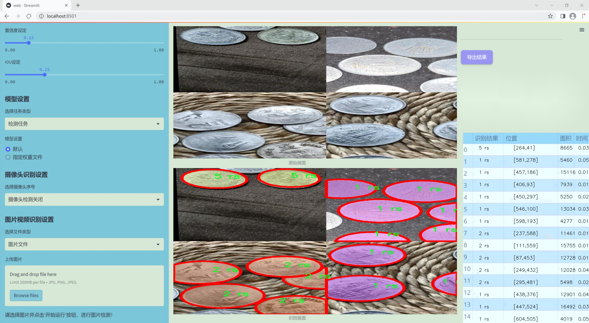
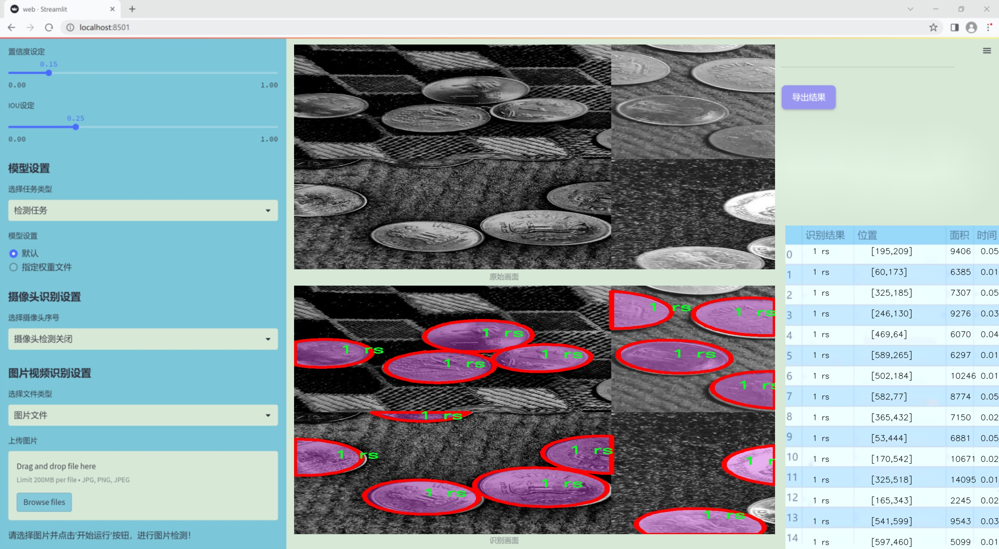
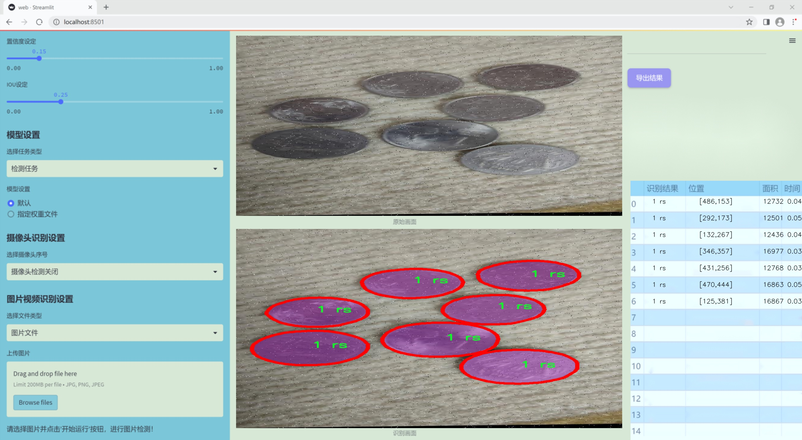
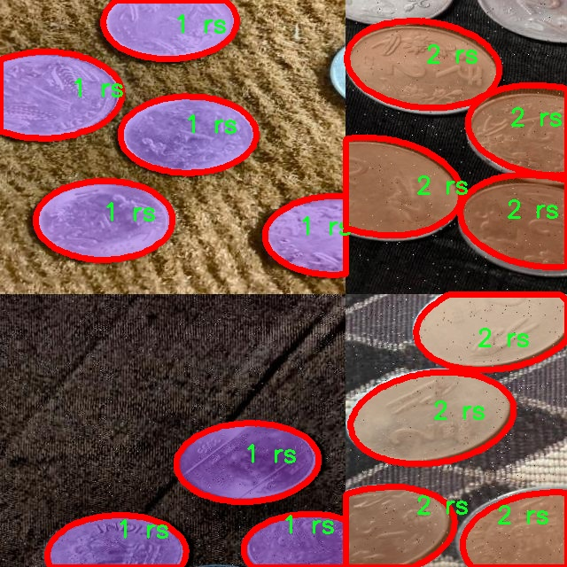
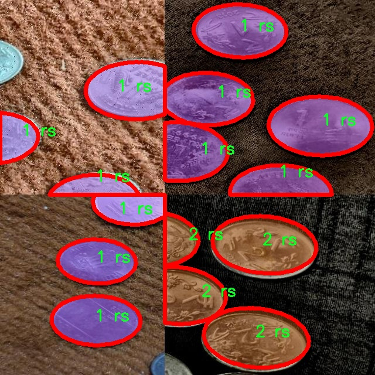
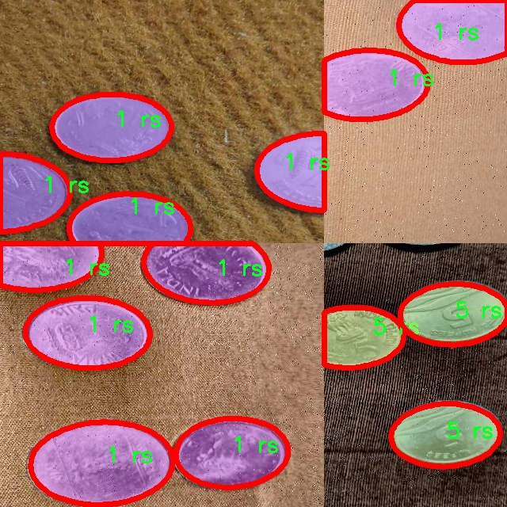
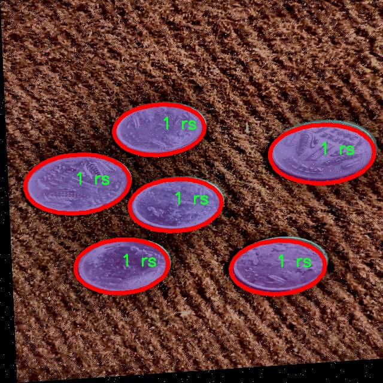
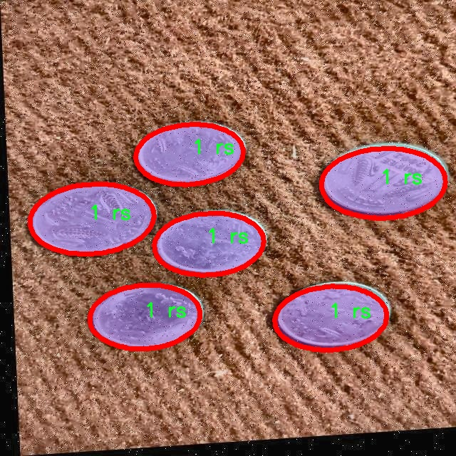

### 1.背景意义

研究背景与意义

随着经济的发展和数字支付的普及，传统硬币的使用逐渐减少，但在某些地区和特定场合，硬币仍然是重要的支付手段。因此，硬币的分类与识别在自动化支付、智能零售和物联网等领域具有重要的应用价值。尤其是在银行、商超和自助售货机等场景中，快速、准确地识别和分类硬币不仅可以提高交易效率，还能降低人工成本，提升用户体验。

近年来，深度学习技术在计算机视觉领域取得了显著进展，尤其是目标检测和实例分割技术的快速发展，为硬币识别提供了新的解决方案。YOLO（You Only Look Once）系列模型因其高效的实时检测能力，已成为目标检测领域的主流选择。随着YOLOv11的推出，其在检测精度和速度上的进一步提升，使其成为硬币分类与识别的理想选择。

本研究旨在基于改进的YOLOv11模型，构建一个高效的硬币分类与识别系统。所使用的数据集包含5600张经过精心标注的硬币图像，涵盖了四种不同面值的硬币（1 rs、2 rs、5 rs、10 rs）。这些图像经过多种预处理和数据增强技术，确保了模型在不同场景下的鲁棒性和准确性。通过对硬币的实例分割和分类，本系统不仅能够实现对硬币的精确识别，还能为后续的自动化交易系统提供数据支持。

此外，本研究的成果将为相关领域的研究提供理论基础和实践指导，推动硬币识别技术的进一步发展。通过提升硬币识别的自动化水平，能够有效应对日益增长的交易需求，促进经济的数字化转型。总之，基于改进YOLOv11的硬币分类与识别系统的研究，不仅具有重要的学术价值，也具备广泛的实际应用前景。

### 2.视频效果

[2.1 视频效果](https://www.bilibili.com/video/BV1Cvq3YuEtz/)

### 3.图片效果







##### [项目涉及的源码数据来源链接](https://kdocs.cn/l/cszuIiCKVNis)**

注意：本项目提供训练的数据集和训练教程,由于版本持续更新,暂不提供权重文件（best.pt）,请按照6.训练教程进行训练后实现上图演示的效果。

### 4.数据集信息

##### 4.1 本项目数据集类别数＆类别名

nc: 4
names: ['1 rs', '10 rs', '2 rs', '5 rs']


该项目为【图像分割】数据集，请在【训练教程和Web端加载模型教程（第三步）】这一步的时候按照【图像分割】部分的教程来训练

##### 4.2 本项目数据集信息介绍

本项目数据集信息介绍

本项目所使用的数据集专注于硬币的分类与识别，旨在改进YOLOv11模型的性能，以实现更高效的硬币识别系统。数据集包含四个主要类别，分别为“1 rs”、“10 rs”、“2 rs”和“5 rs”，这些类别涵盖了印度流通的主要硬币面值。每个类别的样本数量经过精心挑选，以确保模型在训练过程中能够获得足够的多样性和代表性，从而提高其在实际应用中的准确性和鲁棒性。

数据集中的图像均为高质量的硬币照片，拍摄时考虑了不同的光照条件、背景和角度，以模拟真实世界中可能遇到的各种情况。这种多样性不仅增强了模型的泛化能力，还使其能够在不同环境下保持稳定的识别性能。此外，数据集中还包含了多种硬币的细节特征，如硬币的纹理、边缘和图案，这些特征对于分类任务至关重要。

为了确保数据集的有效性和可靠性，所有图像均经过人工标注，确保每个样本的类别信息准确无误。这一过程不仅提高了数据集的质量，也为后续的模型训练奠定了坚实的基础。通过对这些硬币图像的深入分析，模型将能够学习到各个类别之间的细微差别，从而在实际应用中实现快速且准确的硬币识别。

总之，本项目的数据集为改进YOLOv11的硬币分类与识别系统提供了丰富的训练素材，旨在推动智能识别技术在金融领域的应用，提升用户体验与操作效率。通过不断优化和扩展数据集，我们期望能够进一步提高模型的性能，使其在硬币识别任务中表现出色。











### 5.全套项目环境部署视频教程（零基础手把手教学）

[5.1 所需软件PyCharm和Anaconda安装教程（第一步）](https://www.bilibili.com/video/BV1BoC1YCEKi/?spm_id_from=333.999.0.0&vd_source=bc9aec86d164b67a7004b996143742dc)


[5.2 安装Python虚拟环境创建和依赖库安装视频教程（第二步）](https://www.bilibili.com/video/BV1ZoC1YCEBw?spm_id_from=333.788.videopod.sections&vd_source=bc9aec86d164b67a7004b996143742dc)

### 6.改进YOLOv11训练教程和Web_UI前端加载模型教程（零基础手把手教学）

[6.1 改进YOLOv11训练教程和Web_UI前端加载模型教程（第三步）](https://www.bilibili.com/video/BV1BoC1YCEhR?spm_id_from=333.788.videopod.sections&vd_source=bc9aec86d164b67a7004b996143742dc)


按照上面的训练视频教程链接加载项目提供的数据集，运行train.py即可开始训练



     Epoch   gpu_mem       box       obj       cls    labels  img_size
     1/200     20.8G   0.01576   0.01955  0.007536        22      1280: 100%|██████████| 849/849 [14:42<00:00,  1.04s/it]
               Class     Images     Labels          P          R     mAP@.5 mAP@.5:.95: 100%|██████████| 213/213 [01:14<00:00,  2.87it/s]
                 all       3395      17314      0.994      0.957      0.0957      0.0843

     Epoch   gpu_mem       box       obj       cls    labels  img_size
     2/200     20.8G   0.01578   0.01923  0.007006        22      1280: 100%|██████████| 849/849 [14:44<00:00,  1.04s/it]
               Class     Images     Labels          P          R     mAP@.5 mAP@.5:.95: 100%|██████████| 213/213 [01:12<00:00,  2.95it/s]
                 all       3395      17314      0.996      0.956      0.0957      0.0845

     Epoch   gpu_mem       box       obj       cls    labels  img_size
     3/200     20.8G   0.01561    0.0191  0.006895        27      1280: 100%|██████████| 849/849 [10:56<00:00,  1.29it/s]
               Class     Images     Labels          P          R     mAP@.5 mAP@.5:.95: 100%|███████   | 187/213 [00:52<00:00,  4.04it/s]
                 all       3395      17314      0.996      0.957      0.0957      0.0845


###### [项目数据集下载链接](https://kdocs.cn/l/cszuIiCKVNis)

### 7.原始YOLOv11算法讲解

YOLOv11是一种由Ultralytics公司开发的最新一代目标检测模型，以其增强的特征提取能力和更高的效率在计算机视觉领域引人注目。该模型在架构上进行了关键升级，通过更新主干和颈部结构，显著提高了对复杂视觉场景的理解和处理精度。YOLOv11不仅在目标检测上表现出色，还支持实例分割、图像分类、姿态估计和定向目标检测（OBB）等任务，展示出其多功能性。

与其前身YOLOv8相比，YOLOv11在设计上实现了深度和宽度的改变，同时引入了几个创新机制。其中，C3k2机制是对YOLOv8中的C2f的改进，提升了浅层特征的处理能力；C2PSA机制则进一步优化了特征图的处理流程。解耦头的创新设计，通过增加两个深度卷积（DWConv），提高了模型对细节的感知能力和分类准确性。

在性能上，YOLOv11m模型在COCO数据集上的平均精度（mAP）提高，并减少了22%的参数量，确保了在运算效率上的突破。该模型可以部署在多种平台上，包括边缘设备、云平台以及支持NVIDIA GPU的系统，彰显出卓越的灵活性和适应性。总体而言，YOLOv11通过一系列的创新突破，对目标检测领域产生了深远的影响，并为未来的开发提供了新的研究方向。


****文档**** ： _ _https://docs.ultralytics.com/models/yolo11/__

****代码链接**** ： _ _https://github.com/ultralytics/ultralytics__

******Performance Metrics******


​ ** **关键特性****

****◆**** ** **增强的特征提取能力**** ：YOLO11采用了改进的主干和颈部架构，增强了 ** **特征提取****
能力，能够实现更精确的目标检测和复杂任务的执行。

****◆**** ** **优化的效率和速度****
：YOLO11引入了精细化的架构设计和优化的训练流程，提供更快的处理速度，并在准确性和性能之间保持最佳平衡。

****◆**** ** **参数更少、精度更高****
：通过模型设计的改进，YOLO11m在COCO数据集上实现了更高的平均精度（mAP），同时使用的参数比YOLOv8m少22%，使其在计算上更加高效，而不牺牲准确性。

****◆**** ** **跨环境的适应性**** ：YOLO11可以无缝部署在各种环境中，包括边缘设备、云平台和支持NVIDIA
GPU的系统，确保最大的灵活性。

****◆**** ** **支持广泛任务****
：无论是目标检测、实例分割、图像分类、姿态估计还是定向目标检测（OBB），YOLO11都旨在应对一系列计算机视觉挑战。

****支持的任务和模式****


​YOLO11建立在YOLOv8中引入的多功能模型范围之上，为各种计算机视觉任务提供增强的支持:


​该表提供了YOLO11模型变体的概述，展示了它们在特定任务中的适用性以及与Inference、Validation、Training和Export等操作模式的兼容性。从实时检测到复杂的分割任务
，这种灵活性使YOLO11适用于计算机视觉的广泛应用。

##### yolov11的创新

■ yolov8 VS yolov11

YOLOv5，YOLOv8和YOLOv11均是ultralytics公司的作品，ultralytics出品必属精品。


​ **具体创新点** ：

**① 深度（depth）和宽度 （width）**

YOLOv8和YOLOv11是基本上完全不同。

**② C3k2机制**

C3k2有参数为c3k，其中在网络的浅层c3k设置为False。C3k2就相当于YOLOv8中的C2f。


​ **③ C2PSA机制**

下图为C2PSA机制的原理图。


​ **④ 解耦头**

解耦头中的分类检测头增加了两个 **DWConv** 。


▲Conv

    
    
    def autopad(k, p=None, d=1):  # kernel, padding, dilation
    
        """Pad to 'same' shape outputs."""
    
        if d > 1:
    
            k = d * (k - 1) + 1 if isinstance(k, int) else [d * (x - 1) + 1 for x in k]  # actual kernel-size
    
        if p is None:
    
            p = k // 2 if isinstance(k, int) else [x // 2 for x in k]  # auto-pad
    
    return p
    
    
    class Conv(nn.Module):
    
        """Standard convolution with args(ch_in, ch_out, kernel, stride, padding, groups, dilation, activation)."""
    
    
        default_act = nn.SiLU()  # default activation
    
    
        def __init__(self, c1, c2, k=1, s=1, p=None, g=1, d=1, act=True):
    
            """Initialize Conv layer with given arguments including activation."""
    
            super().__init__()
    
            self.conv = nn.Conv2d(c1, c2, k, s, autopad(k, p, d), groups=g, dilation=d, bias=False)
    
            self.bn = nn.BatchNorm2d(c2)
    
            self.act = self.default_act if act is True else act if isinstance(act, nn.Module) else nn.Identity()
    
    
        def forward(self, x):
    
            """Apply convolution, batch normalization and activation to input tensor."""
    
            return self.act(self.bn(self.conv(x)))
    
    
        def forward_fuse(self, x):
    
            """Perform transposed convolution of 2D data."""
    
            return self.act(self.conv(x))

▲Conv2d

    
    
    torch.nn.Conv2d(in_channels, out_channels, kernel_size, stride=1, padding=0, dilation=1, groups=1, bias=True, padding_mode='zeros')

▲DWConv

DWConv ** **代表 Depthwise Convolution（深度卷积）****
，是一种在卷积神经网络中常用的高效卷积操作。它主要用于减少计算复杂度和参数量。

    
    
    class DWConv(Conv):
    
        """Depth-wise convolution."""
    
    
        def __init__(self, c1, c2, k=1, s=1, d=1, act=True):  # ch_in, ch_out, kernel, stride, dilation, activation
    
            """Initialize Depth-wise convolution with given parameters."""
    
            super().__init__(c1, c2, k, s, g=math.gcd(c1, c2), d=d, act=act)


### 8.200+种全套改进YOLOV11创新点原理讲解

#### 8.1 200+种全套改进YOLOV11创新点原理讲解大全

由于篇幅限制，每个创新点的具体原理讲解就不全部展开，具体见下列网址中的改进模块对应项目的技术原理博客网址【Blog】（创新点均为模块化搭建，原理适配YOLOv5~YOLOv11等各种版本）

[改进模块技术原理博客【Blog】网址链接](https://gitee.com/qunmasj/good)


#### 8.2 精选部分改进YOLOV11创新点原理讲解

###### 这里节选部分改进创新点展开原理讲解(完整的改进原理见上图和[改进模块技术原理博客链接](https://gitee.com/qunmasj/good)【如果此小节的图加载失败可以通过CSDN或者Github搜索该博客的标题访问原始博客，原始博客图片显示正常】


### LSKNet的架构
该博客提出的结构层级依次为：

LSK module（大核卷积序列+空间选择机制） < LSK Block （LK Selection + FFN）<LSKNet（N个LSK Block）


#### LSK 模块

LSK Block
LSKNet 是主干网络中的一个可重复堆叠的块（Block），每个LSK Block包括两个残差子块，即大核选择子块（Large Kernel Selection，LK Selection）和前馈网络子块（Feed-forward Network ，FFN），如图8。LK Selection子块根据需要动态地调整网络的感受野，FFN子块用于通道混合和特征细化，由一个全连接层、一个深度卷积、一个 GELU 激活和第二个全连接层组成。

LSK module（LSK 模块，图4）由一个大核卷积序列（large kernel convolutions）和一个空间核选择机制（spatial kernel selection mechanism）组成，被嵌入到了LSK Block 的 LK Selection子块中。

#### Large Kernel Convolutions
因为不同类型的目标对背景信息的需求不同，这就需要模型能够自适应选择不同大小的背景范围。因此，作者通过解耦出一系列具有大卷积核、且不断扩张的Depth-wise 卷积，构建了一个更大感受野的网络。

具体地，假设序列中第i个Depth-wise 卷积核的大小为 ，扩张率为 d，感受野为 ，它们满足以下关系：


卷积核大小和扩张率的增加保证了感受野能够快速增大。此外，我们设置了扩张率的上限，以保证扩张卷积不会引入特征图之间的差距。


Table2的卷积核大小可根据公式（1）和（2）计算，详见下图：


这样设计的好处有两点。首先，能够产生具有多种不同大小感受野的特征，便于后续的核选择；第二，序列解耦比简单的使用一个大型卷积核效果更好。如上图表2所示，解耦操作相对于标准的大型卷积核，有效地将低了模型的参数量。

为了从输入数据  的不同区域获取丰富的背景信息特征，可采用一系列解耦的、不用感受野的Depth-wise 卷积核：


其中，是卷积核为 、扩张率为  的Depth-wise 卷积操作。假设有个解耦的卷积核，每个卷积操作后又要经过一个的卷积层进行空间特征向量的通道融合。


之后，针对不同的目标，可基于获取的多尺度特征，通过下文中的选择机制动态选择合适的卷积核大小。

这一段的意思可以简单理解为：

把一个大的卷积核拆成了几个小的卷积核，比如一个大小为5，扩张率为1的卷积核加上一个大小为7，扩张率为3的卷积核，感受野为23，与一个大小为23，扩张率为1的卷积核的感受野是一样的。因此可用两个小的卷积核替代一个大的卷积核，同理一个大小为29的卷积核也可以用三个小的卷积代替（Table 2），这样可以有效的减少参数，且更灵活。

将输入数据依次通过这些小的卷积核（公式3），并在每个小的卷积核后面接上一个1×1的卷积进行通道融合（公式4）。

#### Spatial Kernel Selection
为了使模型更关注目标在空间上的重点背景信息，作者使用空间选择机制从不同尺度的大卷积核中对特征图进行空间选择。

首先，将来自于不同感受野卷积核的特征进行concate拼接，然后，应用通道级的平均池化和最大池化提取空间关系，其中， 和  是平均池化和最大池化后的空间特征描述符。为了实现不同空间描述符的信息交互，作者利用卷积层将空间池化特征进行拼接，将2个通道的池化特征转换为N个空间注意力特征图，之后，将Sigmoid激活函数应用到每一个空间注意力特征图，可获得每个解耦的大卷积核所对应的独立的空间选择掩膜，又然后，将解耦后的大卷积核序列的特征与对应的空间选择掩膜进行加权处理，并通过卷积层进行融合获得注意力特征 ，最后LSK module的输出可通过输入特征  与注意力特征  的逐元素点成获得，公式对应于结构图上的操作如下：


### 9.系统功能展示

图9.1.系统支持检测结果表格显示

  图9.2.系统支持置信度和IOU阈值手动调节

  图9.3.系统支持自定义加载权重文件best.pt(需要你通过步骤5中训练获得)

  图9.4.系统支持摄像头实时识别

  图9.5.系统支持图片识别

  图9.6.系统支持视频识别

  图9.7.系统支持识别结果文件自动保存

  图9.8.系统支持Excel导出检测结果数据


### 10. YOLOv11核心改进源码讲解

#### 10.1 activation.py

以下是对给定代码的核心部分进行提炼和详细注释的结果：

```python
import torch
import torch.nn as nn

class AGLU(nn.Module):
    """AGLU（Adaptive Gated Linear Unit）激活函数模块。"""

    def __init__(self, device=None, dtype=None) -> None:
        """初始化AGLU激活函数模块。
        
        参数:
        device: 指定张量存储的设备（如CPU或GPU）。
        dtype: 指定张量的数据类型（如float32等）。
        """
        super().__init__()
        # 使用Softplus作为基础激活函数，beta设置为-1.0
        self.act = nn.Softplus(beta=-1.0)
        # 初始化lambda参数，作为可学习的参数
        self.lambd = nn.Parameter(nn.init.uniform_(torch.empty(1, device=device, dtype=dtype)))  
        # 初始化kappa参数，作为可学习的参数
        self.kappa = nn.Parameter(nn.init.uniform_(torch.empty(1, device=device, dtype=dtype)))  

    def forward(self, x: torch.Tensor) -> torch.Tensor:
        """计算AGLU激活函数的前向传播。
        
        参数:
        x: 输入张量，通常是神经网络的输出。
        
        返回:
        经过AGLU激活函数处理后的输出张量。
        """
        # 确保lambda参数不小于0.0001，以避免数值不稳定
        lam = torch.clamp(self.lambd, min=0.0001)
        # 计算AGLU激活函数的输出
        return torch.exp((1 / lam) * self.act((self.kappa * x) - torch.log(lam)))
```

### 代码核心部分说明：
1. **AGLU类**：这是一个自定义的激活函数模块，继承自`nn.Module`。
2. **初始化方法**：
   - `self.act`：使用`Softplus`作为基础激活函数。
   - `self.lambd`和`self.kappa`：两个可学习的参数，初始化为均匀分布的随机值。
3. **前向传播方法**：
   - 输入张量`x`经过`kappa`参数的缩放和`lam`参数的调整后，经过`Softplus`激活函数处理，最后通过指数函数生成输出。

### 注释的目的：
注释详细解释了每个部分的功能和目的，帮助理解AGLU激活函数的实现原理及其在神经网络中的应用。

这个文件定义了一个名为 `activation.py` 的模块，主要用于实现一种激活函数，称为 AGLU（Adaptive Gated Linear Unit）。该模块是基于 PyTorch 框架构建的，包含了一个自定义的神经网络层。

首先，文件导入了必要的库，包括 `torch` 和 `torch.nn`，这两个库是 PyTorch 中用于构建和训练神经网络的核心组件。

接下来，定义了一个名为 `AGLU` 的类，它继承自 `nn.Module`，这是所有 PyTorch 模块的基类。在类的初始化方法 `__init__` 中，首先调用了父类的初始化方法，然后定义了一个激活函数 `self.act`，使用了 `nn.Softplus`，其参数 `beta` 被设置为 -1.0。`Softplus` 是一种平滑的激活函数，类似于 ReLU，但在零点附近更加平滑。

此外，类中还定义了两个可学习的参数 `lambd` 和 `kappa`，它们分别被初始化为均匀分布的随机值。这两个参数使用 `nn.Parameter` 包装，使得它们在训练过程中可以被优化。`lambd` 和 `kappa` 的初始化是在指定的设备（如 CPU 或 GPU）和数据类型下进行的。

在 `forward` 方法中，定义了前向传播的计算过程。输入参数 `x` 是一个张量，表示输入数据。首先，使用 `torch.clamp` 函数将 `lambd` 限制在一个最小值（0.0001）以上，以避免在后续计算中出现除以零的情况。然后，计算激活函数的输出，使用公式 `torch.exp((1 / lam) * self.act((self.kappa * x) - torch.log(lam)))`。这个公式结合了 `Softplus` 激活函数和 `lambd`、`kappa` 参数，形成了 AGLU 激活函数的具体实现。

总的来说，这个文件实现了一个自定义的激活函数模块，能够在神经网络中使用，以增强模型的表达能力。通过引入可学习的参数，AGLU 激活函数能够根据数据自适应地调整其形状，从而提高模型的性能。

#### 10.2 mamba_yolo.py

以下是代码中最核心的部分，并附上详细的中文注释：

```python
import torch
import torch.nn as nn
from einops import rearrange

class LayerNorm2d(nn.Module):
    """自定义的二维层归一化类"""
    def __init__(self, normalized_shape, eps=1e-6, elementwise_affine=True):
        super().__init__()
        # 初始化层归一化
        self.norm = nn.LayerNorm(normalized_shape, eps, elementwise_affine)

    def forward(self, x):
        # 将输入张量的形状从 (B, C, H, W) 转换为 (B, H, W, C)
        x = rearrange(x, 'b c h w -> b h w c').contiguous()
        # 应用层归一化
        x = self.norm(x)
        # 将张量的形状转换回 (B, C, H, W)
        x = rearrange(x, 'b h w c -> b c h w').contiguous()
        return x

class CrossScan(torch.autograd.Function):
    """交叉扫描操作的自定义函数"""
    @staticmethod
    def forward(ctx, x: torch.Tensor):
        B, C, H, W = x.shape
        ctx.shape = (B, C, H, W)
        # 创建一个新的张量用于存储交叉扫描的结果
        xs = x.new_empty((B, 4, C, H * W))
        # 进行交叉扫描
        xs[:, 0] = x.flatten(2, 3)  # 原始顺序
        xs[:, 1] = x.transpose(dim0=2, dim1=3).flatten(2, 3)  # 水平翻转
        xs[:, 2:4] = torch.flip(xs[:, 0:2], dims=[-1])  # 反向顺序
        return xs

    @staticmethod
    def backward(ctx, ys: torch.Tensor):
        B, C, H, W = ctx.shape
        L = H * W
        # 反向传播
        ys = ys[:, 0:2] + ys[:, 2:4].flip(dims=[-1]).view(B, 2, -1, L)
        y = ys[:, 0] + ys[:, 1].view(B, -1, W, H).transpose(dim0=2, dim1=3).contiguous().view(B, -1, L)
        return y.view(B, -1, H, W)

class SelectiveScanCore(torch.autograd.Function):
    """选择性扫描核心操作的自定义函数"""
    @staticmethod
    @torch.cuda.amp.custom_fwd
    def forward(ctx, u, delta, A, B, C, D=None, delta_bias=None, delta_softplus=False, nrows=1, backnrows=1):
        # 确保输入张量是连续的
        if u.stride(-1) != 1:
            u = u.contiguous()
        if delta.stride(-1) != 1:
            delta = delta.contiguous()
        if D is not None and D.stride(-1) != 1:
            D = D.contiguous()
        if B.stride(-1) != 1:
            B = B.contiguous()
        if C.stride(-1) != 1:
            C = C.contiguous()
        
        # 如果 B 或 C 是三维的，增加一个维度
        if B.dim() == 3:
            B = B.unsqueeze(dim=1)
            ctx.squeeze_B = True
        if C.dim() == 3:
            C = C.unsqueeze(dim=1)
            ctx.squeeze_C = True
        
        # 保存上下文信息
        ctx.delta_softplus = delta_softplus
        ctx.backnrows = backnrows
        
        # 调用 CUDA 核心函数进行前向计算
        out, x, *rest = selective_scan_cuda_core.fwd(u, delta, A, B, C, D, delta_bias, delta_softplus, 1)
        ctx.save_for_backward(u, delta, A, B, C, D, delta_bias, x)
        return out

    @staticmethod
    @torch.cuda.amp.custom_bwd
    def backward(ctx, dout, *args):
        # 反向传播
        u, delta, A, B, C, D, delta_bias, x = ctx.saved_tensors
        if dout.stride(-1) != 1:
            dout = dout.contiguous()
        du, ddelta, dA, dB, dC, dD, ddelta_bias, *rest = selective_scan_cuda_core.bwd(
            u, delta, A, B, C, D, delta_bias, dout, x, ctx.delta_softplus, 1
        )
        return (du, ddelta, dA, dB, dC, dD, ddelta_bias, None, None, None, None)

def cross_selective_scan(
        x: torch.Tensor,
        x_proj_weight: torch.Tensor,
        dt_projs_weight: torch.Tensor,
        A_logs: torch.Tensor,
        Ds: torch.Tensor,
        out_norm: torch.nn.Module,
        nrows=-1,
        backnrows=-1,
        delta_softplus=True,
        to_dtype=True,
):
    """交叉选择性扫描的实现"""
    B, D, H, W = x.shape
    D, N = A_logs.shape
    K, D, R = dt_projs_weight.shape
    L = H * W

    # 调用 CrossScan 进行交叉扫描
    xs = CrossScan.apply(x)

    # 进行投影
    x_dbl = torch.einsum("b k d l, k c d -> b k c l", xs, x_proj_weight)
    dts, Bs, Cs = torch.split(x_dbl, [R, N, N], dim=2)
    dts = torch.einsum("b k r l, k d r -> b k d l", dts, dt_projs_weight)
    xs = xs.view(B, -1, L)
    dts = dts.contiguous().view(B, -1, L)

    # HiPPO 矩阵
    As = -torch.exp(A_logs.to(torch.float))  # (k * c, d_state)
    Bs = Bs.contiguous()
    Cs = Cs.contiguous()
    Ds = Ds.to(torch.float)  # (K * c)
    delta_bias = dt_projs_bias.view(-1).to(torch.float)

    # 选择性扫描
    ys: torch.Tensor = SelectiveScanCore.apply(
        xs, dts, As, Bs, Cs, Ds, delta_bias, delta_softplus, nrows, backnrows
    ).view(B, K, -1, H, W)

    # 进行合并
    y: torch.Tensor = CrossMerge.apply(ys)

    # 进行归一化
    y = out_norm(y.transpose(dim0=1, dim1=2).contiguous()).view(B, H, W, -1)

    return (y.to(x.dtype) if to_dtype else y)

class SS2D(nn.Module):
    """选择性扫描 2D 模块"""
    def __init__(self, d_model=96, d_state=16, ssm_ratio=2.0, ssm_rank_ratio=2.0, dropout=0.0):
        super().__init__()
        self.in_proj = nn.Conv2d(d_model, int(ssm_ratio * d_model), kernel_size=1, bias=False)
        self.out_proj = nn.Conv2d(int(ssm_ratio * d_model), d_model, kernel_size=1, bias=False)
        self.dropout = nn.Dropout(dropout)

    def forward(self, x: torch.Tensor):
        x = self.in_proj(x)
        x = cross_selective_scan(x, self.x_proj_weight, self.dt_projs_weight, self.A_logs, self.Ds, self.out_norm)
        x = self.out_proj(x)
        return self.dropout(x)

# 其他模块（如 XSSBlock, VSSBlock_YOLO 等）可以根据需要进行定义
```

### 代码说明：
1. **LayerNorm2d**: 实现了一个二维层归一化的模块，适用于图像数据。
2. **CrossScan**: 自定义的 PyTorch 函数，用于执行交叉扫描操作，主要用于处理输入张量的不同排列。
3. **SelectiveScanCore**: 自定义的选择性扫描核心操作，负责前向和反向传播的计算。
4. **cross_selective_scan**: 实现了交叉选择性扫描的功能，结合了输入的投影和 HiPPO 矩阵的计算。
5. **SS2D**: 选择性扫描 2D 模块，负责输入的投影和输出的生成。

以上是核心部分的代码和详细注释，其他模块可以根据需要进行扩展和定义。

这个程序文件 `mamba_yolo.py` 实现了一种基于深度学习的视觉模型，主要用于目标检测等计算机视觉任务。文件中包含多个类和函数，以下是对其主要内容的逐步说明。

首先，文件导入了一些必要的库，包括 `torch`、`math`、`functools` 和 `torch.nn` 等，这些库为模型的构建和训练提供了基础支持。接着，定义了一个 `LayerNorm2d` 类，它是对二维数据进行层归一化的实现，能够处理图像数据的通道、宽度和高度。

接下来，文件中定义了一些辅助函数，例如 `autopad`，用于自动计算卷积操作所需的填充量，以确保输出的形状与输入相同。

然后，文件中实现了多个自定义的 PyTorch 函数，如 `CrossScan` 和 `CrossMerge`，这些函数用于处理张量的前向和反向传播，特别是在交叉选择扫描的上下文中。它们通过定义 `forward` 和 `backward` 静态方法来实现自定义的前向和反向传播逻辑。

`SelectiveScanCore` 类实现了选择性扫描的核心功能，支持前向和反向传播，并利用 CUDA 加速。该类的实现细节较为复杂，涉及多个输入参数和张量操作。

在 `cross_selective_scan` 函数中，主要实现了选择性扫描的具体操作，处理输入张量并进行必要的线性变换和归一化。

接下来，定义了多个模块类，如 `SS2D`、`RGBlock`、`LSBlock`、`XSSBlock` 和 `VSSBlock_YOLO`。这些模块构成了模型的基础结构，分别实现了不同的功能，例如卷积操作、线性变换、残差连接等。

`SS2D` 类实现了一个基于选择性扫描的二维结构，包含多个卷积层和线性层，用于处理输入特征并提取有用信息。`RGBlock` 和 `LSBlock` 则是一些基础的卷积块，结合了激活函数和归一化层。

`XSSBlock` 和 `VSSBlock_YOLO` 类则是更复杂的模块，结合了前面定义的组件，构成了更高层次的特征提取和处理结构。这些模块通过前向传播方法将输入数据传递并进行处理，最终输出特征图。

`SimpleStem` 和 `VisionClueMerge` 类用于模型的输入处理和特征融合，分别实现了输入特征的初步卷积和不同特征图的合并操作。

整体来看，`mamba_yolo.py` 文件实现了一个复杂的深度学习模型，结合了多种先进的技术，如选择性扫描、残差连接和归一化等，旨在提高计算机视觉任务的性能。通过这些模块的组合，模型能够有效地处理输入图像，提取有用特征，并进行后续的目标检测等任务。

#### 10.3 rmt.py

以下是经过简化并注释的核心代码部分：

```python
import torch
import torch.nn as nn
import torch.nn.functional as F

class DWConv2d(nn.Module):
    """ 深度可分离卷积层 """
    def __init__(self, dim, kernel_size, stride, padding):
        super().__init__()
        # 使用 groups=dim 实现深度可分离卷积
        self.conv = nn.Conv2d(dim, dim, kernel_size, stride, padding, groups=dim)

    def forward(self, x: torch.Tensor):
        """ 前向传播
        x: 输入张量，形状为 (b, h, w, c)
        """
        x = x.permute(0, 3, 1, 2)  # 转换为 (b, c, h, w)
        x = self.conv(x)  # 卷积操作
        x = x.permute(0, 2, 3, 1)  # 转换回 (b, h, w, c)
        return x

class FeedForwardNetwork(nn.Module):
    """ 前馈神经网络 """
    def __init__(self, embed_dim, ffn_dim, activation_fn=F.gelu, dropout=0.0):
        super().__init__()
        self.fc1 = nn.Linear(embed_dim, ffn_dim)  # 第一层线性变换
        self.fc2 = nn.Linear(ffn_dim, embed_dim)  # 第二层线性变换
        self.dropout = nn.Dropout(dropout)  # dropout层
        self.activation_fn = activation_fn  # 激活函数

    def forward(self, x: torch.Tensor):
        """ 前向传播
        x: 输入张量，形状为 (b, h, w, c)
        """
        x = self.fc1(x)  # 线性变换
        x = self.activation_fn(x)  # 激活函数
        x = self.dropout(x)  # dropout
        x = self.fc2(x)  # 线性变换
        return x

class RetBlock(nn.Module):
    """ 保留块，用于处理输入的残差连接和前馈网络 """
    def __init__(self, embed_dim, num_heads, ffn_dim):
        super().__init__()
        self.ffn = FeedForwardNetwork(embed_dim, ffn_dim)  # 前馈网络
        self.pos = DWConv2d(embed_dim, 3, 1, 1)  # 位置卷积

    def forward(self, x: torch.Tensor):
        """ 前向传播
        x: 输入张量，形状为 (b, h, w, c)
        """
        x = x + self.pos(x)  # 添加位置卷积
        x = x + self.ffn(x)  # 添加前馈网络的输出
        return x

class BasicLayer(nn.Module):
    """ 基础层，包含多个保留块 """
    def __init__(self, embed_dim, depth, num_heads, ffn_dim):
        super().__init__()
        self.blocks = nn.ModuleList([
            RetBlock(embed_dim, num_heads, ffn_dim) for _ in range(depth)  # 创建多个保留块
        ])

    def forward(self, x: torch.Tensor):
        """ 前向传播
        x: 输入张量，形状为 (b, h, w, c)
        """
        for blk in self.blocks:
            x = blk(x)  # 逐块处理输入
        return x

class VisRetNet(nn.Module):
    """ 可视化保留网络 """
    def __init__(self, in_chans=3, num_classes=1000, embed_dims=[96, 192, 384, 768], depths=[2, 2, 6, 2], num_heads=[3, 6, 12, 24], ffn_dim=96):
        super().__init__()
        self.patch_embed = nn.Conv2d(in_chans, embed_dims[0], kernel_size=4, stride=4)  # 图像到补丁的嵌入
        self.layers = nn.ModuleList([
            BasicLayer(embed_dim=embed_dims[i], depth=depths[i], num_heads=num_heads[i], ffn_dim=ffn_dim) for i in range(len(depths))
        ])

    def forward(self, x: torch.Tensor):
        """ 前向传播
        x: 输入张量，形状为 (b, c, h, w)
        """
        x = self.patch_embed(x)  # 嵌入操作
        for layer in self.layers:
            x = layer(x)  # 逐层处理
        return x

# 创建模型实例
def RMT_T():
    model = VisRetNet(
        embed_dims=[64, 128, 256, 512],
        depths=[2, 2, 8, 2],
        num_heads=[4, 4, 8, 16]
    )
    return model

if __name__ == '__main__':
    model = RMT_T()  # 创建模型
    inputs = torch.randn((1, 3, 640, 640))  # 随机输入
    res = model(inputs)  # 前向传播
    print(res.size())  # 输出结果的形状
```

### 代码注释说明：
1. **DWConv2d**: 实现深度可分离卷积的模块，适用于图像特征提取。
2. **FeedForwardNetwork**: 实现前馈神经网络，包括线性变换和激活函数。
3. **RetBlock**: 包含残差连接和前馈网络的模块，能够增强模型的学习能力。
4. **BasicLayer**: 由多个保留块组成的基础层，负责处理输入特征。
5. **VisRetNet**: 主网络结构，负责将输入图像转化为特征表示，包含补丁嵌入和多个基础层。
6. **RMT_T**: 用于创建特定配置的可视化保留网络模型实例。

这个程序文件 `rmt.py` 实现了一个基于视觉变换器（Vision Transformer）的网络模型，名为 `VisRetNet`，并定义了一些相关的模块和功能。代码中包含多个类和函数，每个类和函数负责不同的功能，整体结构清晰，适合进行图像处理和特征提取。

首先，程序导入了必要的库，包括 PyTorch 和一些自定义的层和模块。接着，定义了一些基础的卷积层、注意力机制和网络层。以下是各个部分的详细说明：

1. **DWConv2d 类**：实现了深度可分离卷积，主要用于减少参数数量和计算量。它将输入的张量进行维度变换，然后应用卷积操作，最后再变换回原来的维度。

2. **RelPos2d 类**：用于生成二维相对位置编码，支持生成不同维度的衰减掩码。这个类在注意力机制中非常重要，因为它帮助模型理解输入特征之间的相对位置关系。

3. **MaSAd 和 MaSA 类**：这两个类实现了多头自注意力机制。`MaSAd` 适用于分块的注意力计算，而 `MaSA` 则用于整体的注意力计算。它们通过线性变换生成查询、键和值，并结合相对位置编码进行注意力计算。

4. **FeedForwardNetwork 类**：实现了前馈神经网络，包含两个线性层和激活函数。它用于在每个变换层后处理特征。

5. **RetBlock 类**：定义了一个残差块，结合了注意力机制和前馈网络。它可以选择性地使用层归一化和层缩放，以提高模型的稳定性和性能。

6. **PatchMerging 类**：实现了图像的分块合并层，主要用于下采样操作，将特征图的分辨率降低。

7. **BasicLayer 类**：构建了一个基本的变换器层，包含多个残差块，并在最后进行下采样。

8. **LayerNorm2d 类**：实现了二维层归一化，用于对特征图进行归一化处理。

9. **PatchEmbed 类**：将输入图像转换为补丁嵌入，使用卷积层进行特征提取，并将输出的特征图转换为适合后续处理的格式。

10. **VisRetNet 类**：这是整个模型的核心类，负责构建整个网络结构。它包括多个基本层和补丁嵌入层，并实现了前向传播方法。

最后，文件中定义了几个函数（`RMT_T`, `RMT_S`, `RMT_B`, `RMT_L`），用于创建不同规模的 `VisRetNet` 模型。这些函数根据不同的参数设置构建模型，并返回相应的网络实例。

在 `__main__` 部分，代码创建了一个 `RMT_T` 模型实例，并生成一个随机输入进行测试，输出每个特征图的尺寸。这部分代码可以用来验证模型的构建是否正确。

总体来说，这个程序文件展示了如何构建一个复杂的视觉变换器模型，结合了多种深度学习技术，如自注意力机制、前馈网络和层归一化等，适用于图像分类和特征提取任务。

#### 10.4 rep_block.py

以下是代码中最核心的部分，并附上详细的中文注释：

```python
import torch
import torch.nn as nn
import torch.nn.functional as F

def transI_fusebn(kernel, bn):
    """
    将卷积核和批归一化层的参数融合为一个卷积核和偏置。
    
    参数:
    kernel: 卷积核权重
    bn: 批归一化层
    
    返回:
    融合后的卷积核和偏置
    """
    gamma = bn.weight  # 获取批归一化的缩放因子
    std = (bn.running_var + bn.eps).sqrt()  # 计算标准差
    # 融合卷积核和批归一化
    return kernel * ((gamma / std).reshape(-1, 1, 1, 1)), bn.bias - bn.running_mean * gamma / std

def conv_bn(in_channels, out_channels, kernel_size, stride=1, padding=0, dilation=1, groups=1):
    """
    创建一个卷积层和批归一化层的组合。
    
    参数:
    in_channels: 输入通道数
    out_channels: 输出通道数
    kernel_size: 卷积核大小
    stride: 步幅
    padding: 填充
    dilation: 膨胀
    groups: 分组卷积的组数
    
    返回:
    包含卷积层和批归一化层的序列
    """
    conv_layer = nn.Conv2d(in_channels=in_channels, out_channels=out_channels, kernel_size=kernel_size,
                           stride=stride, padding=padding, dilation=dilation, groups=groups,
                           bias=False)  # 创建卷积层，不使用偏置
    bn_layer = nn.BatchNorm2d(num_features=out_channels, affine=True)  # 创建批归一化层
    return nn.Sequential(conv_layer, bn_layer)  # 返回包含卷积和批归一化的序列

class DiverseBranchBlock(nn.Module):
    def __init__(self, in_channels, out_channels, kernel_size, stride=1, padding=None, dilation=1, groups=1):
        """
        初始化多分支块。
        
        参数:
        in_channels: 输入通道数
        out_channels: 输出通道数
        kernel_size: 卷积核大小
        stride: 步幅
        padding: 填充
        dilation: 膨胀
        groups: 分组卷积的组数
        """
        super(DiverseBranchBlock, self).__init__()
        self.kernel_size = kernel_size
        self.in_channels = in_channels
        self.out_channels = out_channels
        self.groups = groups
        
        if padding is None:
            padding = kernel_size // 2  # 默认填充为卷积核大小的一半
        assert padding == kernel_size // 2  # 确保填充正确

        # 定义原始卷积和批归一化层
        self.dbb_origin = conv_bn(in_channels=in_channels, out_channels=out_channels, kernel_size=kernel_size,
                                  stride=stride, padding=padding, dilation=dilation, groups=groups)

    def forward(self, inputs):
        """
        前向传播函数。
        
        参数:
        inputs: 输入张量
        
        返回:
        输出张量
        """
        out = self.dbb_origin(inputs)  # 通过原始卷积和批归一化层计算输出
        return out  # 返回输出

# 示例使用
if __name__ == "__main__":
    model = DiverseBranchBlock(in_channels=3, out_channels=16, kernel_size=3)
    x = torch.randn(1, 3, 224, 224)  # 创建一个随机输入
    output = model(x)  # 通过模型进行前向传播
    print(output.shape)  # 输出形状
```

### 代码核心部分解释：
1. **transI_fusebn**: 该函数用于将卷积层的权重和批归一化层的参数融合，生成一个新的卷积核和偏置。这在模型推理时可以减少计算量。

2. **conv_bn**: 该函数创建一个包含卷积层和批归一化层的序列，方便在模型中使用。

3. **DiverseBranchBlock**: 这是一个自定义的神经网络模块，包含一个卷积层和批归一化层。其构造函数接受输入通道数、输出通道数、卷积核大小等参数，并在前向传播中计算输出。

4. **forward**: 前向传播方法，接受输入并通过定义的卷积层和批归一化层计算输出。

以上是对代码中最核心部分的保留和详细注释。

这个程序文件 `rep_block.py` 定义了一些用于构建神经网络中多样化分支模块的类和函数，主要用于深度学习中的卷积神经网络（CNN）。文件中使用了 PyTorch 框架，并实现了一些特定的卷积操作和批归一化（Batch Normalization）功能。

首先，文件中导入了必要的库，包括 `torch` 和 `torch.nn`，并从其他模块中引入了一些自定义的卷积函数。接下来，定义了一些转换函数，例如 `transI_fusebn`、`transII_addbranch` 等，这些函数主要用于处理卷积核和偏置的融合、合并等操作，以便在网络推理时提高效率。

接下来，定义了几个类，主要包括 `DiverseBranchBlock`、`WideDiverseBranchBlock` 和 `DeepDiverseBranchBlock`，这些类实现了不同类型的分支模块。每个模块的构造函数中都包含了多个卷积层和批归一化层的组合，具体的实现细节根据输入和输出通道数、卷积核大小、步幅、填充等参数进行调整。

`DiverseBranchBlock` 类实现了一个多样化的分支模块，支持多种卷积操作，包括 1x1 卷积和 kxk 卷积。它还提供了一个 `switch_to_deploy` 方法，用于在推理阶段将模型转换为更高效的形式，减少计算量。

`WideDiverseBranchBlock` 类则在此基础上增加了对水平和垂直卷积的支持，能够处理不同方向的卷积操作，并将其结果合并到输出中。这个模块在设计上更为复杂，能够处理更丰富的特征信息。

`DeepDiverseBranchBlock` 类是一个更深层次的模块，允许用户自定义内部卷积通道数，并支持在推理阶段的高效转换。

此外，文件中还定义了一些辅助类，如 `IdentityBasedConv1x1` 和 `BNAndPadLayer`，分别用于实现带有身份映射的 1x1 卷积和结合批归一化的填充层。这些类的设计旨在增强模型的灵活性和可扩展性。

总体来说，这个文件实现了一种灵活的神经网络模块设计，能够根据不同的需求组合多种卷积操作，并通过批归一化提高训练和推理的效率。通过这些模块，用户可以方便地构建和调整深度学习模型，以适应各种计算任务。

### 11.完整训练+Web前端界面+200+种全套创新点源码、数据集获取


# [下载链接：https://mbd.pub/o/bread/Z5yYm55t](https://mbd.pub/o/bread/Z5yYm55t)